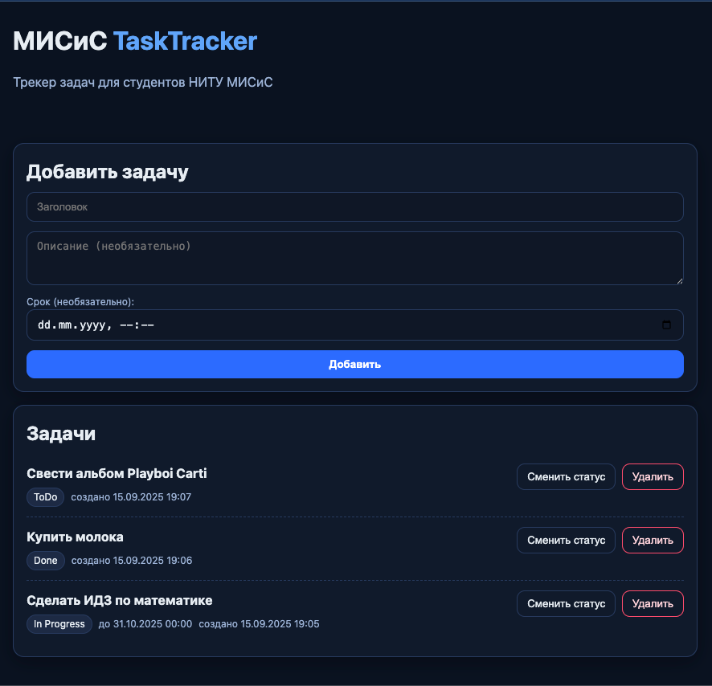

# 📝 МИСиС TaskTracker


**МИСиС TaskTracker** — это трекер задач для итоговой аттестации

Проект создан в учебных целях: чтобы показать архитектуру клиент-серверного приложения на **FastAPI + PostgreSQL**, упакованного в **Docker**.

## 🚀 Возможности
- Добавление задач (заголовок, описание, срок выполнения).
- Просмотр списка задач.
- Смена статуса: `todo → in_progress → done`.
- Удаление задач.
- Интерфейс в синих тонах на HTML + CSS (Jinja2 шаблоны).
- Автоматическая документация API на `/docs`.

## 🛠️ Технологии
- **Backend:** [FastAPI](https://fastapi.tiangolo.com/)  
- **DB:** [PostgreSQL](https://www.postgresql.org/) + SQLAlchemy  
- **Templates:** Jinja2 (HTML + CSS)  
- **Deploy:** Docker + Docker Compose  

## ⚡ Запуск проекта

### 1. Клонировать репозиторий
```bash
git clone https://github.com/SadLiter/misis-tasktracker.git
cd misis-tasktracker
````

### 2. Создать `.env` из шаблона

```bash
cp .env.example .env
```

### 3. Запустить Docker

```bash
docker compose up --build
```

### 4. Открыть в браузере

* Приложение: [http://localhost:8000](http://localhost:8000)
* Документация API: [http://localhost:8000/docs](http://localhost:8000/docs)

## 📸 Скриншоты

Главная страница:



## 👨 Авторы

Проект разработан в рамках итоговой аттестации Цифровой кафедры НИТУ «МИСиС».

Волков В. А.
БИВТ-23-УП-1
GitHub: https://github.com/SadLiter

Малютин А. Д.
БИВТ-23-ПАУ-1
GitHub: https://github.com/Sailor-moon13 

Голощапов Д. В.
БИВТ-23-ПАУ-1
GitHub: https://github.com/Dmitry27912
